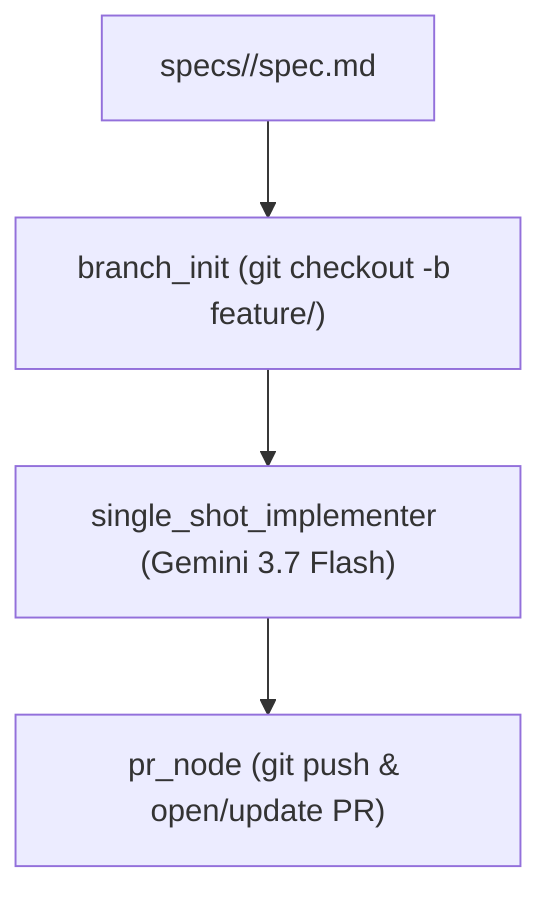

# Implementer Agent Skill

This skill provides the standard workflow to invoke the **Fast Single-Shot Implementer Agent** (`sdlc-agents/implementer`), progressing a feature specification through automated single-shot code implementation and PR generation with real-time status streaming.

---

## When to Use This Skill

Activate this skill when:
- The user asks to implement or develop a feature specification (e.g., `specs/<feature>/spec.md` or `docs/specs/<feature>.md`).
- The user asks to "run the implementer agent", "execute spec", or "implement feature".
- Fast automated SDLC implementation is required for a feature.

---

## Agent Architecture

The implementer agent runs as a streamlined **Antigravity SDK Pipeline**:



---

## Real-Time Status Streaming

The implementer agent emits live progress status messages with compact badges throughout each stage of execution:
- **`[Branch]`**: 🌿 Feature branch checkout and workspace preparation.
- **`[Implementer]`**: 🚀 Single-shot implementation start, file updates, and completion summary.
- **`[Git]`**: 💾 Automatic git commits for generated feature code.
- **`[PR]`**: 📬 Pull Request creation or update with summary report.

---

## Invocation Instructions

### 1. Identify Target Specification
Ensure the target specification exists at:
`specs/<feature>/spec.md` or `docs/specs/<feature>.md`

### 2. Invoke via the Client Tool
Execute the client script using the `sdlc-agents` Python environment:

```bash
python3 sdlc-agents/implementer/client.py specs/<feature>
```

#### What this command does automatically:
1. **Active Check**: Scans ports `8090` through `8099` to see if an implementer server is active.
2. **Auto-Launch**: If no active server is found, selects the first available port in `8090-8099`, launches `uvicorn server:app --port <port> --reload` in the background, and waits for health readiness.
3. **Task Dispatch & Live SSE Streaming**: Dispatches the feature spec path to `/tasks` and streams live Server-Sent Events (SSE) telemetry directly to the console in real-time.

---

## Direct CLI Mode (Alternative)

To run the workflow in-process directly via CLI without HTTP:

```bash
python3 sdlc-agents/implementer/main.py specs/<feature>
```
